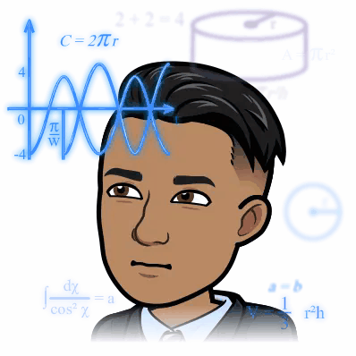
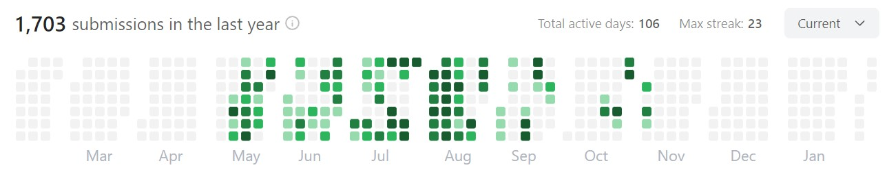

  

  

  

<h2  align="center">💡 VIEW IN LIGHT MODE 💡</h2>

Biography
  

  

- 🌏 Lives in **Hyderabad,India**

- 👨‍💻 Upcoming Data Scientist @ **[Asper.ai](https://www.asper.ai/)**
- 🎓 Read **M.Tech. Artificial Intelligence** ('23) from **[IIT Roorkee](https://www.iitr.ac.in/mfsdsai/)**
- 🧠 Learning: **Probablistic Machine Learning** & **Confirmal Prediction**
- 📖
  Reading: **[The Course of Love-Alain de Botton](https://www.goodreads.com/user/show/103756796-vikas-potluri)**
- 🎧
  Listening: **[Lex Fridman Podcasts](https://www.youtube.com/@lexfridman)**
- 👓
  GodFathers: **[Marcus Aurelius ](https://www.youtube.com/watch?v=Auuk1y4DRgk)**
   **[Jordan Peterson ](https://www.youtube.com/watch?v=L47oJxwp6yg)**
    **[S.N Goenka ](https://www.youtube.com/watch?v=cz7QHNvNFfA&list=PLPJVlVRVmhc4Z01fD57jbzycm9I6W054x)**
- 😎Interests: Badminton 🏸, Books(Philosophy,Psychology)📖
- ⚡ Fun fact: **Econometrics is Original Data Science**

> "Don't just say you have read books. Show that through them you have learned to think better, to be a more discriminating and reflective person.**Books are the training weights of the mind**. They are very helpful, but it would be a bad mistake to suppose that one has made progress simply by having internalized their contents."
 -EPICTETUS

Languages
  

<code></code>
<code></code>
<code></code>
<code></code>
<code></code>

  

 

Technology
  

<code></code>
<code></code>
<code></code>
<code></code>
<code></code>
<code></code>
<code></code>
<code></code>
<code></code>
<code></code>
<code></code>
<code></code>
<code></code>

 

<!-- Activity graph -->

[comment]: <> (

)
